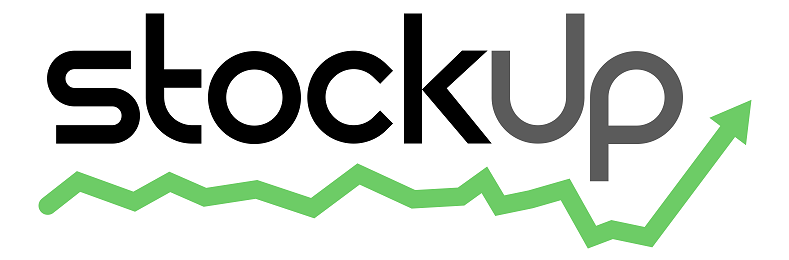
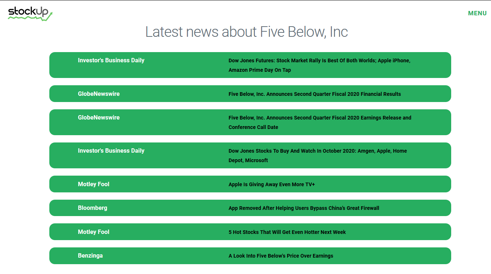
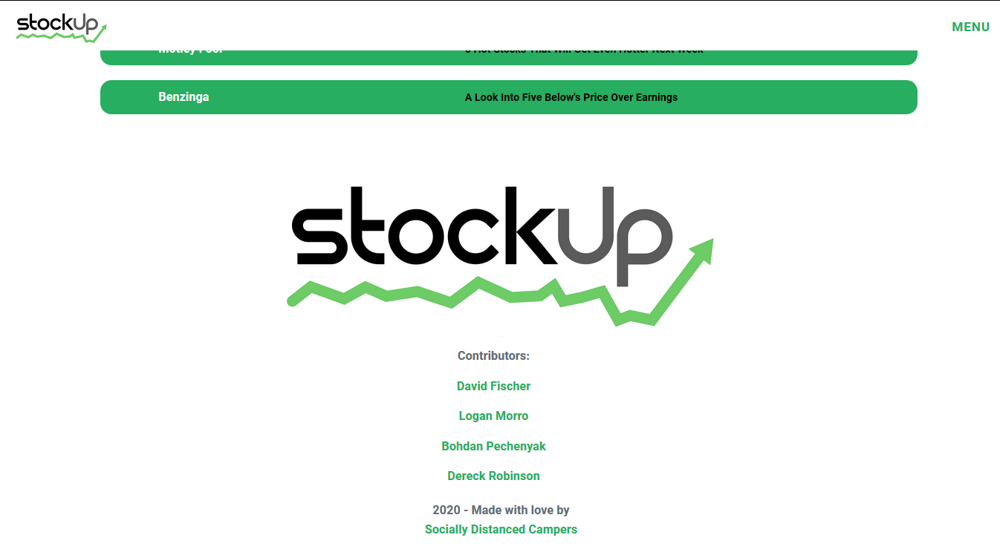

# StockUp - Easy Investment Research

An mobile-first responsive application to help investors do company research, using [Alpha Vantage Stock API](https://www.alphavantage.co/) to get the basic stock quotes and [Yahoo Finance API](https://rapidapi.com/apidojo/api/yahoo-finance1/endpoints) to get the latest news on the searched stock. Additionally, the historical weekly data retrieved from Alpha Vantage API is loaded into a [Chart.js API](https://chartjs.org/) graph for visual display. 

The styling was done using [Milligram.io](https://milligram.io) minimalist CSS framework. 

## Technologies Used

* Semantic HTML - to build the basic page structure
* Responsive CSS - to style the page and set up the mobile-first responsive layout
* Javascript - to ensure functionality, get and parse the API data, and load it into the HTML document.
    * Event handling - listening for form submission and drowndown menu activation
    * AJAX - to make HTTP requests for JSON data
    * jQuery - to load the data into HTML elements 
    * Chart.js and Canvas API - to draw a chart using the parsed JSON data

# The Vision

## User Story and the Solution

- IF I’m beginner investor, 
- I WANT a simple way to look up basic stock information, and
- THEN use this information to make financial decisions.

Investing can seem complicated for newcomers. With StockUp, the developing team wanted to make investing easier for anyone trying to enter into the markets. How did we choose to do that? By giving beginners the basic tools they need, all in one page.

Basic capabilities of the StockUp applications: 
* Searching companies you’re interested in by stock symbol
* Retrieving useful information:
    * Basic set of up-to-date stock performance data
    * Weekly closing prices over the prior year in a chart format
    * Financial news articles relevant to the company being researched

## Future Directions

* Streamline - News search: expand the article display, add at least an image and a synopsis for each link.
* Expand - Chart: expand the range of data that can be displayed, add options to view different time periods
* Add - Search criteria: add more filters and search capabilities (search by market sector, industry, specific index or fund, etc.)

Further functionality: provide or reference other tools that help make an informed investment decision and follow the next steps in the investment process. 

# Link to the finished app

[StockUp - Information for Investors](https://bohdicave.github.io/StockUp)

# Screenshots

## Mobile-first

## General

