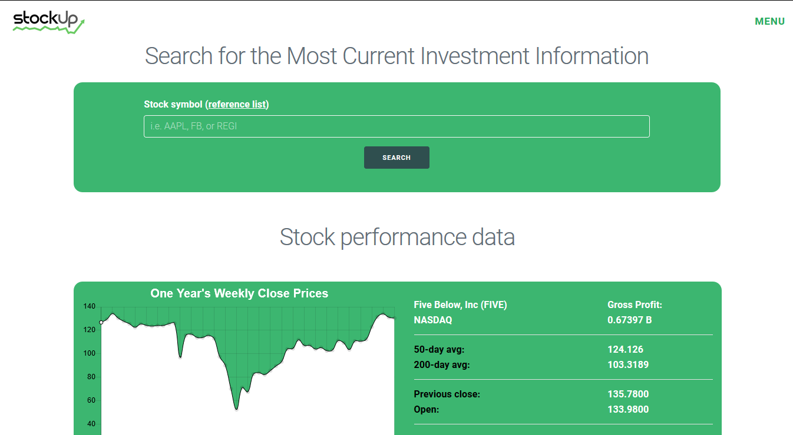

# StockUp

An mobile-first responsive application to help investors do company research, using [Financial Modeling Prep API](https://financialmodelingprep.com/) to get the basic stock quotes and [Yahoo Finance API](https://rapidapi.com/apidojo/api/yahoo-finance1/endpoints) to get the latest news on the searched stock.

The styling was done using [Milligram.io](https://milligram.io) minimalist CSS framework. 

# Linked to the finished app

[StockUp - Information for Investors](https://bohdicave.github.io/StockUp)

# Screenshots

## Mobile-first

## General

